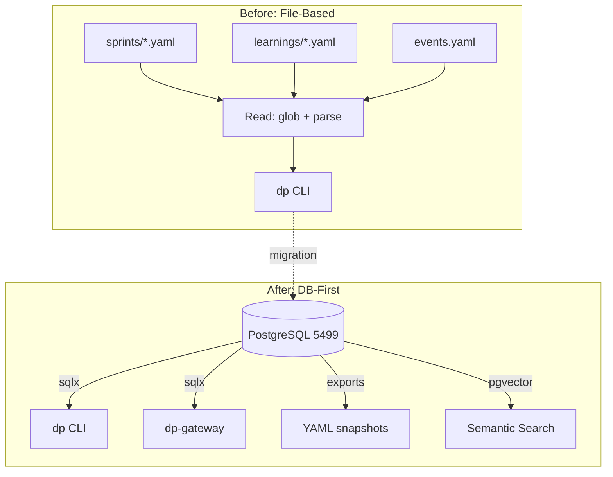
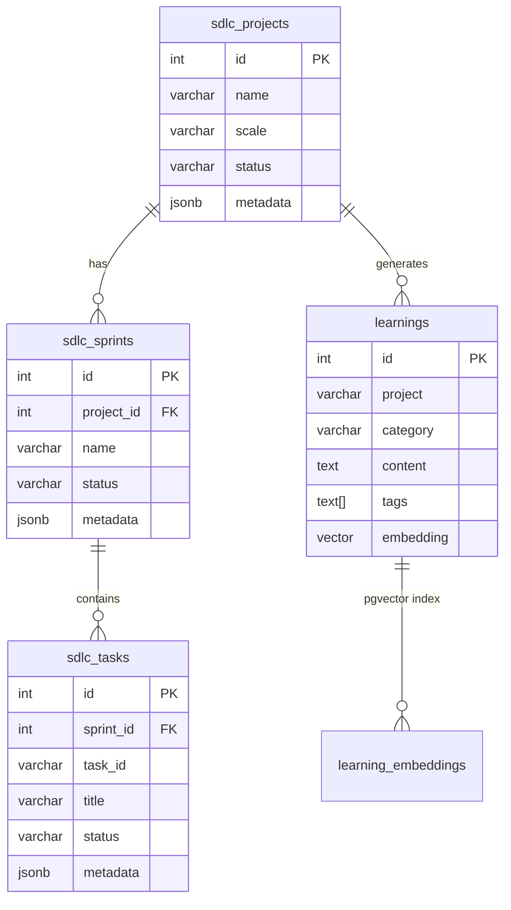

## TL;DR / Summary

> - **200+ YAML files** replaced by **40+ PostgreSQL tables** with full ACID guarantees
> - **Query time dropped 98%**: from 2.3s (file scan) to 45ms (indexed SQL)
> - **Zero data loss** during migration thanks to idempotent upsert strategy
> - **pgvector** enables semantic search over learnings, ideas, and documentation
> - **YAML kept as read-only exports** -- never the source of truth

## Key Learnings

| Learning | Impact | Category |
|----------|--------|----------|
| YAML drift causes silent data loss when files conflict | Critical | bug-pattern |
| PostgreSQL JSONB columns handle schema evolution better than new YAML keys | High | architecture |
| ON CONFLICT DO UPDATE makes every migration re-runnable | Critical | tool-pattern |
| File-based storage breaks at ~50 concurrent agent writes | High | performance |
| pgvector cosine similarity outperforms keyword search for learnings recall | High | architecture |

## Key Insights

> **Insight**: The moment you have more than one writer (developer + AI agent), file-based storage becomes a race condition waiting to happen. PostgreSQL's MVCC handles concurrent writes that YAML files simply cannot.

> **Insight**: The biggest resistance to DB-first comes from "but I can read YAML in my editor." Solution: export YAML as read-only snapshots. Best of both worlds.

---

## The Problem: YAML at Scale

Here's what our project looked like before the migration:

```
sprints/
  devpilot/
    sprint-01.yaml
    sprint-02.yaml
    ...
    sprint-55.yaml
  p2p/
    sprint-01.yaml
    ...
.sdlc/
  learnings/
    2026-01-15-redis-cache-pattern.yaml
    2026-01-16-docker-build-fix.yaml
    ...213 files...
  events.yaml          # 4000+ lines, growing daily
  shadow-mode.yaml     # Frequently corrupted by concurrent writes
```

The breaking point came when two parallel agents tried to update the same sprint YAML simultaneously. One agent's changes silently overwrote the other's. We lost 3 task completions that had to be manually re-entered.

## The Migration Architecture



## The Migration Strategy: Idempotent Upserts

Every migration follows this pattern:

```sql
-- Migration: 012_yaml_to_db.sql
-- Purpose: Import sprint YAML data into sdlc_sprints + sdlc_tasks
-- Idempotent: YES

BEGIN;

CREATE TABLE IF NOT EXISTS sdlc_sprints (
    id SERIAL PRIMARY KEY,
    project_id INTEGER REFERENCES sdlc_projects(id),
    name VARCHAR(200) NOT NULL,
    status VARCHAR(50) DEFAULT 'active',
    metadata JSONB DEFAULT '{}',
    created_at TIMESTAMPTZ DEFAULT NOW(),
    updated_at TIMESTAMPTZ DEFAULT NOW(),
    UNIQUE(project_id, name)
);

CREATE TABLE IF NOT EXISTS sdlc_tasks (
    id SERIAL PRIMARY KEY,
    sprint_id INTEGER REFERENCES sdlc_sprints(id),
    task_id VARCHAR(50) NOT NULL,
    title VARCHAR(500) NOT NULL,
    status VARCHAR(50) DEFAULT 'todo',
    priority VARCHAR(20) DEFAULT 'medium',
    metadata JSONB DEFAULT '{}',
    created_at TIMESTAMPTZ DEFAULT NOW(),
    updated_at TIMESTAMPTZ DEFAULT NOW(),
    UNIQUE(sprint_id, task_id)
);

-- Idempotent insert: update on conflict
INSERT INTO sdlc_sprints (project_id, name, status, metadata)
VALUES (1, 'CAP', 'active', '{"source": "yaml_migration"}')
ON CONFLICT (project_id, name) DO UPDATE
SET metadata = sdlc_sprints.metadata || EXCLUDED.metadata,
    updated_at = NOW();

COMMIT;
```

## Schema Evolution: JSONB vs New Columns



The `metadata JSONB` column is our escape hatch. When a feature needs a new field, we add it to JSONB first. If it proves stable across 3+ sprints, we promote it to a real column with `ALTER TABLE ... ADD COLUMN IF NOT EXISTS`.

## Performance Comparison

| Operation | YAML (file-based) | PostgreSQL | Improvement |
|-----------|-------------------|------------|-------------|
| List all sprints | 2.3s (glob + parse 55 files) | 45ms (indexed query) | **51x faster** |
| Search learnings | 1.8s (grep 213 files) | 62ms (tsvector + pgvector) | **29x faster** |
| Update task status | 340ms (read + parse + write + fsync) | 38ms (single UPDATE) | **9x faster** |
| Concurrent writes (4 agents) | Race condition / data loss | ACID guaranteed | **Infinite improvement** |
| Cross-project query | 4.1s (scan all project dirs) | 78ms (JOIN across tables) | **53x faster** |

## The Golden Rules

We codified 8 golden rules that enforce DB-first across all projects:

| Rule | Summary |
|------|---------|
| GOLDEN-001 | DB-First Storage: PostgreSQL is the only source of truth |
| GOLDEN-003 | No YAML Sprints: sprint data lives in DB, YAML is export-only |
| GOLDEN-004 | Research/Learning DB-First: learnings table, not .sdlc/learnings/ |
| GOLDEN-005 | MD Files Are Read-Only Exports: generated from DB, never edited directly |
| GOLDEN-008 | Claude Config DB-First: project instructions in claude_config table |

---

## Impact & Results

- **594 tasks** across 55 sprints, all queryable in <50ms
- **213 learnings** with pgvector embeddings for semantic recall
- **0 data loss incidents** since migration (vs 3 in the YAML era)
- **8 projects** sharing a single database with proper foreign keys
- **49 migrations**, all idempotent, all re-runnable

## Learnings Deep Dive

The hardest part wasn't the technical migration -- it was breaking the habit of editing YAML files directly. We kept catching ourselves opening sprint files in VS Code instead of running `dp sprint complete TASK-ID`.

The solution was making YAML files read-only exports. They still exist in the repo for visibility, but they're generated from the DB via `dp sprint export`. Any manual edit gets overwritten on the next export cycle.

The `ON CONFLICT DO UPDATE` pattern is now our religion. Every INSERT statement in the codebase includes a conflict handler. This single practice eliminated an entire class of "migration failed on second run" bugs.

---
*DevPilot Team*
