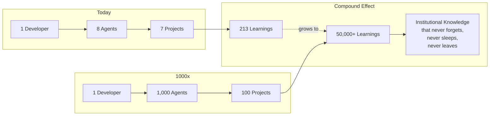

Today we're excited to introduce **DevPilot**, a development velocity engine designed to help solo developers and small teams build software 10x faster.

## The Problem

As solo developers and small teams, we're expected to do everything:

- Write code
- Run tests
- Deploy infrastructure
- Create documentation
- Generate reports
- Track sprints
- Handle customer support
- Create marketing content

It's exhausting. And it's unsustainable.

## The Solution: Virtual Teams

DevPilot introduces the concept of a **Virtual Team (VT)** — AI-powered agents that specialize in different roles:

| Agent | What They Do |
|-------|--------------|
| 🧪 **QA** | Run tests, track bugs, monitor coverage |
| 💼 **Sales** | Track revenue, manage forecasts |
| 📣 **Marketing** | Generate content, run campaigns |
| 🔬 **Researcher** | Analyze codebases, write specs |
| ⚙️ **DevOps** | Deploy, monitor, manage infrastructure |
| 💻 **Developer** | Write code, review PRs |

You chat with them naturally. They understand context. They execute.

```bash
# Chat with your QA agent
dp vt chat qa
> "Run all tests for the auth module"

# Assign a task to marketing
dp vt assign marketing "Write a blog post about the new feature"
```

## Content Factory

Tired of writing the same reports every week? The Content Factory auto-generates:

- **Sprint Reports** — Complete with metrics, charts, and next steps
- **Release Notes** — Parsed from your git commits
- **Health Dashboards** — Visual project status
- **Blog Posts** — Technical content from your codebase

```bash
# Generate a sprint report
dp content sprint-report

# Generate release notes
dp content release-notes v1.0..v1.1

# Create a blog post
dp content blog --topic "New Feature X"
```

## Sprint Management from the CLI

Full sprint tracking without leaving your terminal:

```bash
# View sprint status
dp sprint status

# Kanban board view
dp sprint status --board

# Let the AI drive
dp sprint auto
```

## Built with Rust + Flutter

DevPilot is built on a solid foundation:

- **Rust** — Core library and CLI for maximum performance
- **Flutter** — Cross-platform mobile and desktop apps
- **PostgreSQL** — For production data
- **SQLite** — For local development

## What's Next

We're just getting started. Here's what's coming:

1. **Voice Commands** — Talk to your virtual team
2. **Meeting Notes** — Auto-transcribe and extract action items
3. **Competitive Intel** — Monitor competitors automatically
4. **Custom Agents** — Define your own team members

## Vision: 1000x

Everything above is what DevPilot does today. Here's where it's going.

**The mission: 1 developer + 1,000 AI agents = the output of a 50-person engineering organization -- at 1/10th the cost.**

Right now, DevPilot manages 7 projects with 600+ tasks across 55 sprints, powered by 8 parallel agents and 213 cross-pollinating learnings. That's already a multiplier most solo developers never achieve. But the architecture -- Rust core, PostgreSQL backbone, DAG-based orchestrator -- was designed from day one to scale three orders of magnitude further.



> **The compound learning effect**: With 213 learnings cross-pollinating across 7 projects today, each new project benefits from everything learned before it. At 100 projects, a single bug fix propagates to 99 other codebases automatically. The knowledge flywheel becomes the moat.

| Metric | Today | At 1000x |
|--------|-------|----------|
| Projects managed | 7 | 100 |
| Parallel agents | 8 | 1,000 |
| Tasks/sprint | 20-30 | 5,000+ |
| Cross-project learnings | 213 | 50,000+ |
| Human operators | 1 | 1 |
| Equivalent team size | ~5 devs | ~50 devs |

| What scales | How | Why it matters |
|-------------|-----|----------------|
| Agent count | Distributed orchestrator pools | More parallelism, more throughput |
| Project count | CoPilot app manages 100 projects from one screen | One developer, one portfolio |
| Knowledge base | Every project feeds learnings to all others | Compound returns on every insight |
| Specialization | Agent pools by skill (Rust, Flutter, SQL, DevOps) | Expert-level work in every domain |

The CoPilot app on your phone becomes mission control -- approving decisions, reviewing agent output, steering priorities across 100 projects. Not writing code. Not debugging tests. Not deploying infrastructure. Just making the decisions that only a human should make, while 1,000 agents handle the execution.

This is what DevPilot is building toward. The foundation is live. The scaling is next.

## Get Started

```bash
# Install the CLI
cargo install dp-cli

# Initialize your project
dp init

# Start your virtual team
dp vt status
```

---

*DevPilot is currently in active development. Star us on [GitHub](https://github.com/devpilot) to follow along!*
