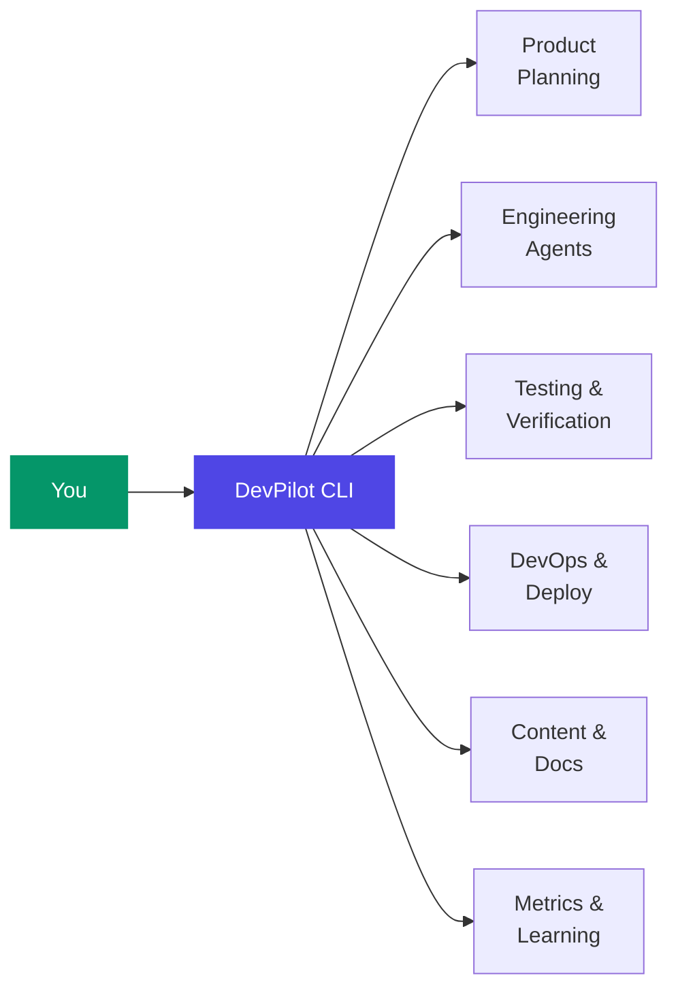
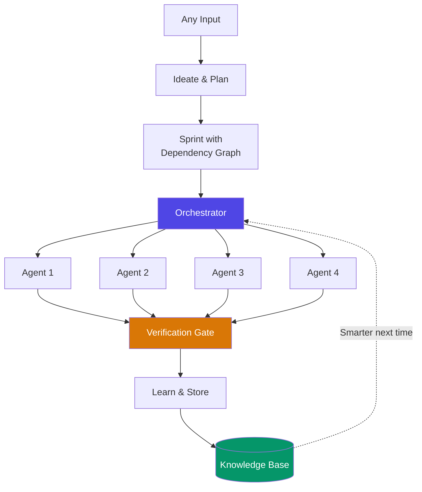
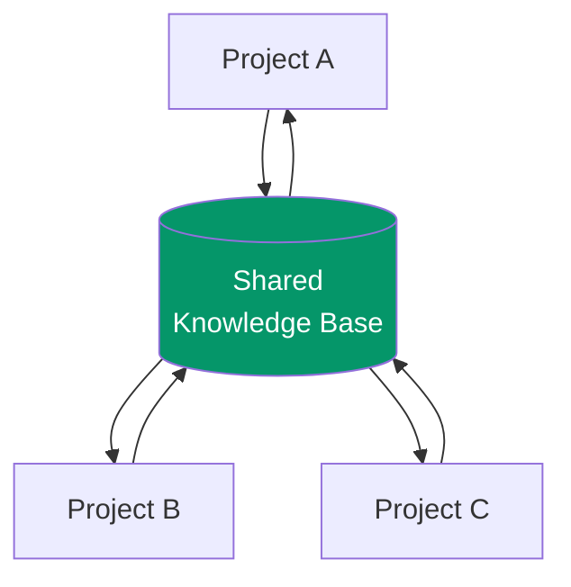

Today we're introducing **DevPilot** -- a development velocity engine that gives a solo developer the output of a **100-person engineering team**.

Not 10x. **100x.**

## The Problem

As solo developers, we're expected to wear every hat:

- Write features, fix bugs, review code
- Run tests, track coverage, manage quality
- Deploy infrastructure, monitor uptime
- Create documentation, reports, changelogs
- Track sprints, manage backlogs, plan roadmaps
- Generate content, pitch decks, blog posts

That's 6+ full-time roles. No human can do all of them well.

## The Solution: 100 Virtual Team Members

DevPilot replaces those roles with **AI-powered agents** orchestrated by a Rust engine and controlled from a single CLI:



You make the decisions. They handle the execution.

| Traditional Team | DevPilot Equivalent |
|------------------|---------------------|
| Product manager | `dp ideate` -- generates requirements from text, voice, screenshots |
| 10 engineers | `dp sprint auto` -- dispatches parallel AI agents |
| QA team | Verification gates after every task |
| DevOps | `dp ship` -- build, test, deploy, verify |
| Technical writer | `dp content` -- reports, docs, blog posts |
| Data analyst | Self-learning loop captures every outcome |

## How the Engine Works



1. **Ideate** -- Turn any input (text, voice, screenshot, PDF) into structured requirements
2. **Plan** -- Auto-generate a sprint with dependency graph and parallel batches
3. **Execute** -- Up to 8 agents work in parallel with stuck detection and checkpoints
4. **Verify** -- Every task passes through automated verification gates
5. **Learn** -- Successes and failures feed back into the knowledge base

The **self-learning loop** is what makes this compound: each sprint is smarter than the last.

## Sprint Management from the CLI

Full sprint tracking without leaving your terminal:

```bash
dp sprint status            # View sprint progress
dp sprint status --board    # Kanban view
dp sprint auto              # Let agents drive
dp sprint auto -m 8         # 8 parallel agents
```

## Content Factory

Auto-generates everything a content team would produce:

```bash
dp content sprint-report    # Sprint report with metrics
dp content release-notes    # Changelog from git
dp content blog             # Blog post from project data
```

## Cross-Project Intelligence

Every project feeds learnings to every other project. A bug fix pattern from one codebase enriches the knowledge base for all managed projects.



> A single insight propagates to every project automatically. The knowledge flywheel becomes the moat.

## Built with Rust + Flutter

| Component | Technology |
|-----------|------------|
| Core Engine | Rust -- speed, safety, concurrency |
| CLI | 42+ commands, NLP interface |
| Gateway | Axum, JSON-RPC over WebSocket |
| Command Center | Flutter desktop + mobile |
| Database | PostgreSQL -- source of truth |
| AI | Pluggable -- Claude, GPT, Ollama |

## The Numbers So Far

| Metric | Value |
|--------|-------|
| Projects managed | 7 |
| Sprints completed | 55+ |
| Tasks tracked | 600+ |
| Cross-project learnings | 200+ |
| Parallel agents | up to 8 |
| Human operators | **1** |

## What's Next

- **Voice Commands** -- Talk to your agents
- **Rapid Build** -- Idea to running app in 30 minutes
- **CoPilot Mobile** -- Approve agent decisions from your phone
- **1000 Agents** -- Scaling the orchestrator to manage 100 projects simultaneously

## The 100x Philosophy

1. **Replace departments, not tasks** -- Entire functions automated end-to-end
2. **Self-improving** -- Every execution makes the next one better
3. **DB-first** -- PostgreSQL is the source of truth, not files
4. **Ship > Perfect** -- Working code beats polished plans
5. **Offline-first** -- Local tools before cloud. AI is the last resort

The foundation is live. 7 projects, 600+ tasks, 200+ learnings, all managed by one developer with AI agents doing the work of a full team.

---

*One developer. 100 virtual team members. Zero meetings. Follow along on our [blog](https://blog.devpilot.co.in).*
