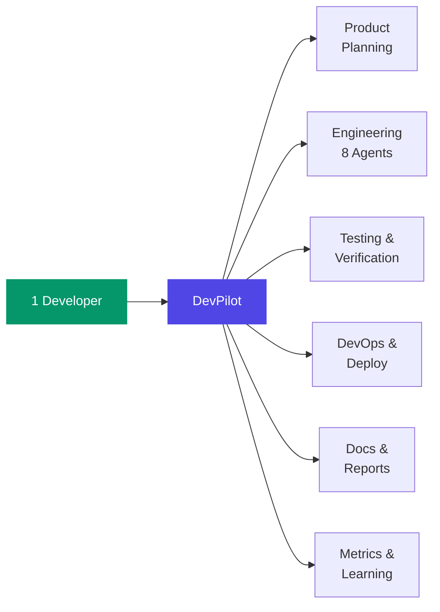
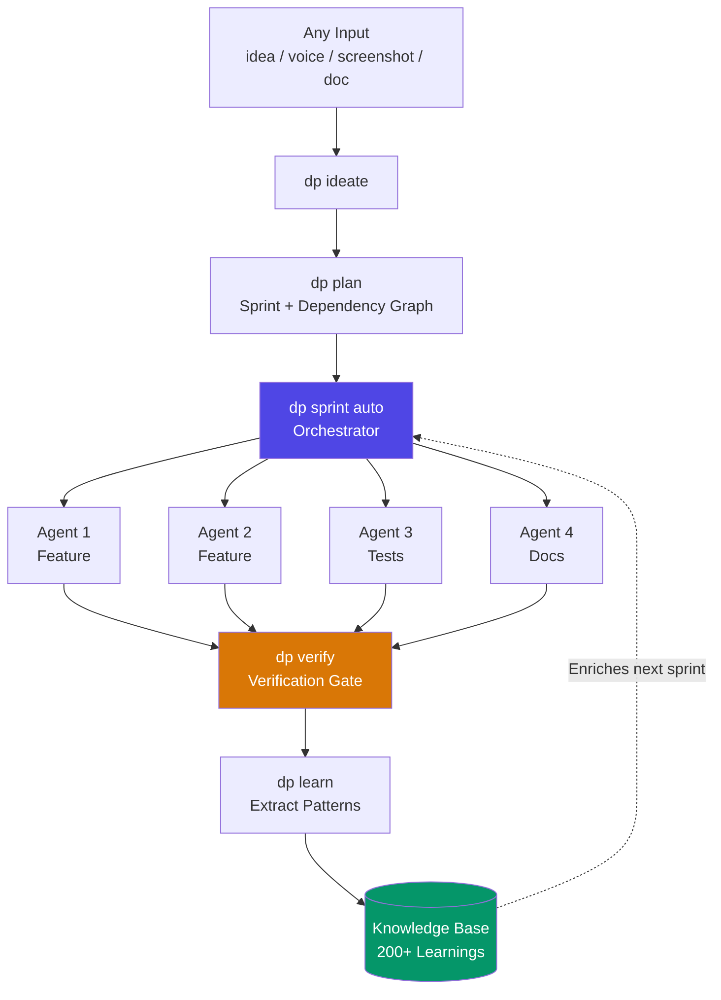

# About DevPilot

DevPilot is a **development velocity engine** -- a Rust CLI + Flutter command center that gives a solo developer the output of a **100-person engineering team**.

---

## The 100x Vision

Most tools promise 10x. DevPilot delivers **100x** -- not by working harder, but by replacing entire departments with AI-powered agents that plan, build, test, deploy, and learn from every execution.

**One developer. Zero meetings. Full-stack output.**

> **The goal**: 1 developer doing the work of 100 virtual team members -- backed by AI agents, a self-learning knowledge base, and a Rust-powered orchestration engine.

---

## What DevPilot Replaces

| Traditional Team (100 people) | DevPilot (1 developer) |
|------|------|
| Product managers write specs | `dp ideate` generates structured requirements from any input |
| 10 engineers implement features | `dp sprint auto` dispatches up to 8 parallel AI agents |
| QA team writes and runs tests | Agents auto-generate tests + verification gates |
| DevOps manages CI/CD pipelines | `dp ship` handles build, test, deploy, verify |
| Tech writers produce docs | `dp content` auto-generates reports, changelogs, posts |
| Data team tracks metrics | Self-learning loop captures every outcome to DB |
| Project managers track progress | Orchestrator with dependency resolution + batching |

---

## How It Works

The **self-learning loop** is the key differentiator: every success and failure feeds back into the knowledge base, making each subsequent sprint faster and more accurate.

---

## Core Capabilities

### AI Agent Orchestra

Up to 8 parallel agents with role specialization, stuck detection, checkpoint recovery, and permission batching. The orchestrator handles dependency resolution, topological sorting, and verification gates.

### Self-Improving SDLC

Every task execution records verification results. The system injects relevant learnings into agent context before each new task. Accuracy trends are tracked per agent, per phase -- enabling data-driven improvement.

### Cross-Project Intelligence

Learnings from any project feed all projects. A bug fix discovered in one codebase automatically enriches the knowledge base for every managed project.

### Content Factory

Sprint reports, release notes, blog posts, architecture docs -- all generated from project data with mermaid diagrams, metrics tables, and polished PDF output.

### CoPilot Command Center

A Flutter desktop + mobile app that serves as the CEO dashboard. Sprint tracking, agent monitoring, workflow management, knowledge browsing -- all in one pane.

---

## Tech Stack

| Component | Technology | Purpose |
|-----------|------------|---------|
| Core Engine | Rust | Speed, safety, zero-cost abstractions |
| CLI | Rust (clap) | 42+ commands, orchestrator, NLP interface |
| Gateway | Rust (Axum) | JSON-RPC over WebSocket, real-time events |
| Command Center | Flutter | Desktop + mobile, cross-platform |
| Database | PostgreSQL | Source of truth for everything |
| AI Provider | Pluggable | Claude, GPT, Ollama -- any LLM |

---

## Philosophy

1. **100x, not 10x** -- Replace departments, not just tasks
2. **DB-first** -- PostgreSQL is the source of truth. Files are exports
3. **Self-improving** -- Every execution makes the next one better
4. **Ship > Perfect** -- Working MVP beats polished vaporware
5. **Offline-first** -- Local tools before cloud. AI is the last resort

---

## By the Numbers

| Metric | Current |
|--------|---------|
| Projects managed | 7 |
| Sprints completed | 55+ |
| Tasks tracked | 600+ |
| Cross-project learnings | 200+ |
| Parallel agents | up to 8 |
| Human operators | **1** |

---

*Built with Rust. Powered by AI. Driven by one developer doing the work of 100.*
